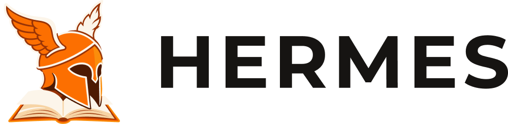

# 🦉 Hermes: Vida Escolar em Tempo Real

> Projeto Integrado III - Equipe Hermes (UFCA/Várzea Alegre)

## 📑 Tabela de Conteúdos
* [Sobre o Projeto](#-sobre-o-projeto)
* [Arquitetura e Tecnologias](#%EF%B8%8F-arquitetura-e-tecnologias)
* [Contribuições](#-contribuições)

---
## 🤝 Contribuições

Esta atualização incluiu a criação da página de funcionalidades em `pages/funcionalidades.html`, com seções para Agenda Escolar, Notificações, Frequência, Notas, Calendário, Atendimento e Gestão Escolar.

## 💻 Sobre o Projeto

O **Hermes** é uma solução multiplataforma (Web e Mobile) desenvolvida para resolver a **falha de comunicação entre escolas e pais/responsáveis**.

Atualmente, a dependência de métodos ultrapassados, como agendas físicas, gera um fluxo de informações tardio e inseguro. O Hermes atua como uma central de controle, permitindo o acompanhamento da vida escolar em tempo real, desde a frequência até o desempenho acadêmico.

---
# PAEDI - Painel de Acompanhamento Digital Escolar Integrado (Plataforma Hermes)

## 🏗️ Arquitetura e Tecnologias

O sistema foi concebido sob a ótica da escalabilidade, segurança e alta disponibilidade, utilizando um modelo totalmente desacoplado entre o cliente e o servidor. A infraestrutura base é dividida nas seguintes camadas:

### 📱 Frontend
Desenvolvido como uma **Single Page Application (SPA)** utilizando **React** e **Vite**. É responsável pela interface, gerenciamento do estado local e renderização dinâmica para smartphones e computadores.
* **Hospedagem:** Vercel

### ⚙️ Backend
Construído em **Java** com o framework **Spring Boot**. Segue o padrão de controladores, serviços e repositórios, centralizando as regras de negócio, segurança (RBAC) e validação de dados. 
* **Hospedagem:** Railway

### 🗄️ Banco de Dados
Persistência relacional utilizando o **PostgreSQL Serverless**. Garante a integridade referencial e segurança total dos dados acadêmicos e registros dos estudantes.
* **Infraestrutura:** Neon

### 🔄 Integração e Comunicação
* **REST & JSON:** O Frontend e o Backend se comunicam exclusivamente via requisições HTTP RESTful, trafegando dados em JSON.
* **ORM:** A ponte entre a aplicação e a base de dados é feita de forma segura via **Spring Data JPA**.
* **JWT:** O tráfego de dados sensíveis exige autenticação com tokens para proteger a privacidade dos alunos e responsáveis.

  

O **PAEDI** é um sistema digital projetado para mitigar os desafios de comunicação, monitoramento e engajamento na rotina escolar de estudantes brasileiros. Através da plataforma **Hermes**, o software atua como um elo em tempo real entre instituições de ensino, professores, alunos e pais/responsáveis que possuem rotinas exigentes e precisam superar barreiras físicas e de tempo para acompanhar a vida escolar dos filhos de forma transparente e consolidada.

A aplicação web conta com recursos focados em:
* 📊 Acompanhamento de rendimento por meio de notas e gráficos de desempenho.
* 📝 Registro de frequência escolar e controle diário de presença.
* 📢 Canal de avisos urgentes, comunicados da coordenação e cronogramas gerais.
* 💬 Sistema de mensagens assíncronas (chat) direto entre professores e responsáveis.

---

## 🛠️ Tecnologias Utilizadas

O front-end institucional e os painéis de visualização foram desenvolvidos com foco em acessibilidade, semântica e responsividade, utilizando:
* **HTML5** (Estruturação semântica de layouts)
* **CSS3** (Estilização moderna via Flexbox, CSS Grid e variáveis nativas)
* **JavaScript** (Comportamento dinâmico e interações de interface)

---

## 👥 Equipe de Desenvolvimento

* **Antonio Airlon da Silva Filho** (Matrícula: 2025016882)
* **Antonio Lucas da Costa Pereira** (Matrícula: 2025019042)
* **Everton Lucas Fernandes** (Matrícula: 2025017020)
* **Felipe Alves Bezerra Neto** (Matrícula: 2025017048)
* **Joenio Borges de Araújo** (Matrícula: 2025017084)
* **Rubens Paulo Rodrigues Parente** (Matrícula: 2025017262)

---

## 🔗 Links do Projeto

* **Repositório no GitHub:** [Acesse o código-fonte aqui](https://github.com/Hermes-Core/hermes-frontend.git)
* **Protótipo no Figma:** [Acesse o design completo no Figma](https://www.figma.com/design/AunQbW8QXLnwTBiPqwHEIS/Fluxos-Usuarios?node-id=0-1&t=9J2pzqjSfVfXchpi-1)

---

## 🏫 Informações Acadêmicas

* **Instituição:** Universidade Federal do Cariri (UFCA)
* **Curso:** Tecnologia em Análise e Desenvolvimento de Sistemas (ADS)
* **Disciplina:** Desenvolvimento para Web
* **Professor Orientador:** Dr. Jayr Alencar Pereira

---

  <small>Universidade Federal do Cariri • Centro de Educação a Distância • 2026</small>

